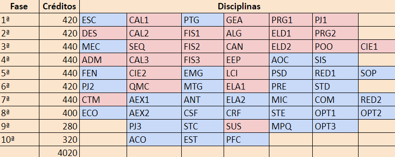
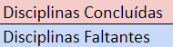

# Engenharia de Telecomunicações 📚 

Este repositório contém links para os repositórios de algumas disciplinas do curso de [Engenharia de Telecomunicações](https://wiki.sj.ifsc.edu.br/index.php/Portal_da_Engenharia_de_Telecomunica%C3%A7%C3%B5es_do_IFSC_(Curso_1290)) do [IFSC](https://www.ifsc.edu.br/):

- [ELD2](https://github.com/luizakuze/ELD2) - Eletrônica Digital 2
- [POO](https://github.com/luizakuze/POO) - Programação Orientada a Objetos
- [CAN](https://github.com/luizakuze/CAN) - Cálculo Numérico
- [PRG1](https://github.com/luizakuze/PRG1) - Programação 1
- [PRG2](https://github.com/luizakuze/PRG2) - Programação 2

Este é o meu desenvolvimento no curso até o momento:

